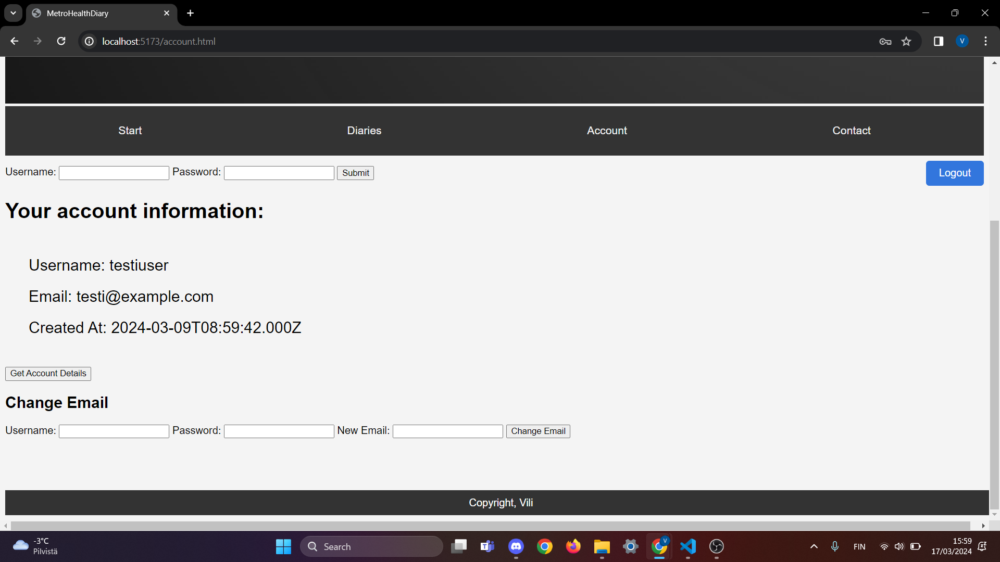
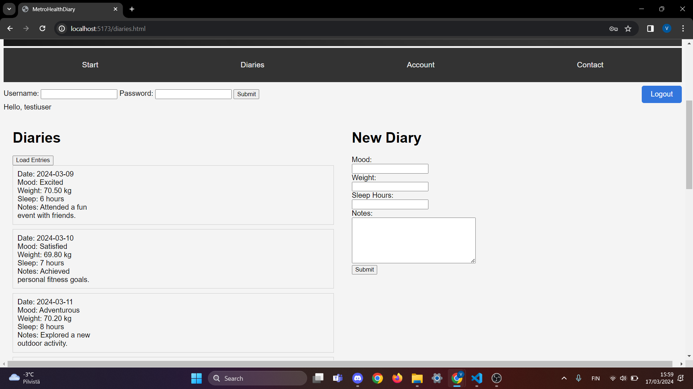
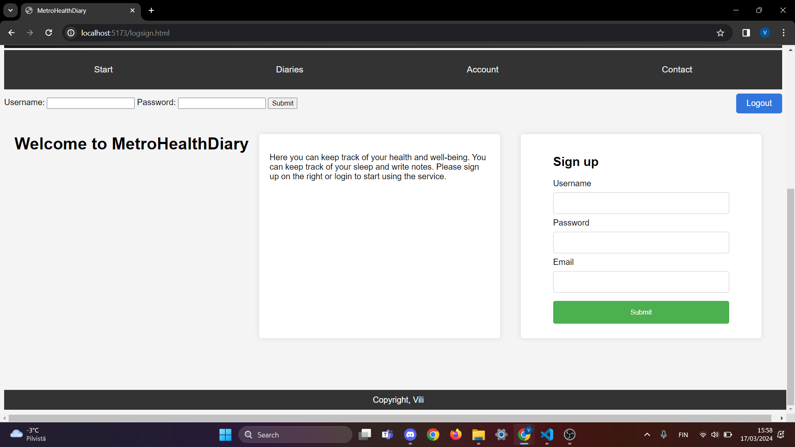
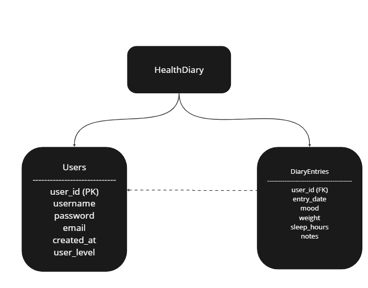

# Project Name

A brief description of your project.

## Table of Contents

- [Installation](#installation)
- [Usage](#usage)

## Installation

No need for installation

## Usage

When not logged in:
-User can make a new user
-User can login to existing user

When logged in:
-User can create a new diary entry
-User can load existing diary entries
-User can load user data (username, email and create at)
-User can change email
-User can logout

Example queries:

# Login
POST http://localhost:3000/api/users/login
content-type: application/json
{
  "username": "testiuser",
  "password": "testi123"
}

# Create user (register)
POST http://127.0.0.1:3000/api/users
content-type: application/json

{
  "username": "testi",
  "password": "testi123",
  "email": "testi@example.com"
}

# Update user's own data (requires token)
PUT http://127.0.0.1:3000/api/users/
Authorization: Bearer <token>
content-type: application/json

{
  "username": "testi",
  "password": "testi123",
  "email": "testit@example.com"
}

# Post entry
POST http://localhost:3000/api/entries
content-type: application/json

{
  "entry_date": "2024-03-17",
  "mood": "Test",
  "weight": 80.00,
  "sleep_hours": 8,
  "notes": "This was a good testi",
  "user_id": 6
}

# Get entries
GET http://localhost:3000/api/entries
Authorization: Bearer + token

# Pictures from UI

I went for modern minimalistic design. Every page has login possibility and logout button.

## Codes:
Back-end: https://github.com/vilihak/server-example (public)
Front-end: https://github.com/vilihak/vite/tree/main/vite-websovellus (public)

## Bugs/problems
Not know bugs or problems. Issue with launching the serve to website

## References 
-Used Github user "mattpe"'s backend
-Course material
-W3schools and stackoverflow
-When stuck and clueless some VSCode Copilot help

## Database
